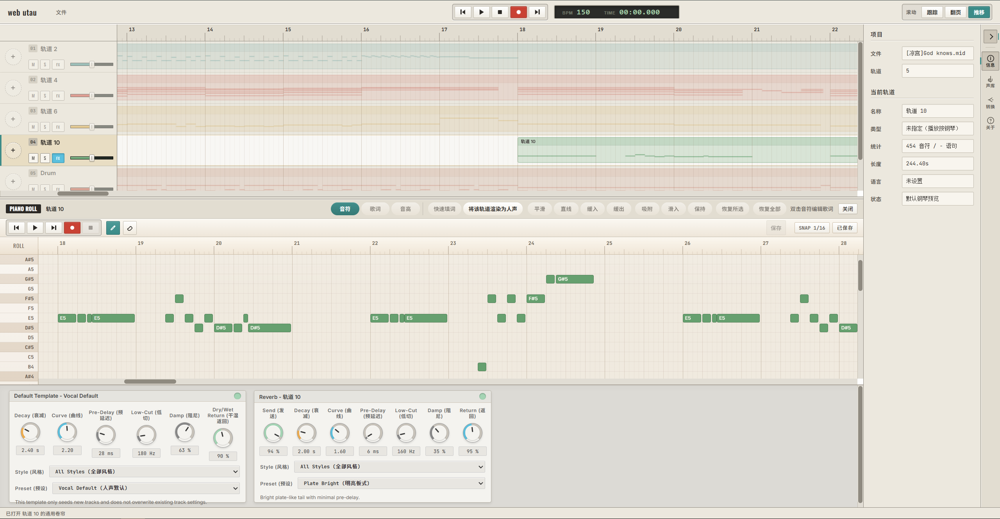

# Melody Singer

**浏览器端虚拟歌姬工作站** — 导入 MIDI，填写歌词，让虚拟歌姬为你演唱！



## 功能亮点

### 虚拟歌姬演唱
基于 [OpenUtau](https://github.com/stakira/OpenUtau) 歌声合成引擎，支持加载 UTAU 主流声库，在浏览器中即可驱动虚拟歌姬声库演唱你编写的旋律与歌词。

### 音色转换
集成 [SeedVC](https://github.com/Plachtaa/seed-vc) 音色转换技术，可将歌姬的演唱转换为目标音色，拓展声音表现力。

### 钢琴卷帘编辑器
直观的钢琴卷帘界面，支持 MIDI 导入与手动编辑，提供音高、时值的精细控制。

### 歌词编辑
支持中文与日语歌词输入，提供快速填词面板，可批量填写并自动匹配音符。

### 多轨乐器伴奏
内置钢琴、小提琴、鼓组等多种乐器音色，支持多轨编排与混音，为歌声配上完整伴奏。

### 混音与效果
轨道级混响、音量控制，多种预设效果风格，让作品更具表现力。

## 快速开始

### 环境要求

- [Node.js](https://nodejs.org/) LTS
- [Git](https://git-scm.com/)

### 安装与启动

```bash
git clone https://github.com/Marigold1122/melody-singer.git
cd melody-singer
npm install
```

从 [Releases](https://github.com/Marigold1122/melody-singer/releases) 下载最新后端运行时，解压到 `server/` 目录，确保 `server/DiffSingerApi.exe` 存在。

将声库放入 `server/voicebanks/` 下（每个歌手为独立子文件夹）。

```bash
dev.bat
```

打开浏览器访问 http://localhost:3000 即可使用。

<details>
<summary><strong>从源码构建后端</strong></summary>

需要 [.NET 8 SDK](https://dotnet.microsoft.com/download/dotnet/8.0)：

```bash
dotnet publish server/DiffSingerApi/DiffSingerApi.csproj -c Release -o server
```

使用 `dev-source.bat` 可直接从源码启动后端与前端开发服务器。

</details>

<details>
<summary><strong>SeedVC 音色转换（可选）</strong></summary>

需要 [Python 3.10](https://www.python.org/downloads/release/python-31011/)，建议配备 NVIDIA GPU（GTX 1060+）。

```bash
git clone https://github.com/Plachtaa/seed-vc.git external/seed-vc
cd external/seed-vc
python -m venv .venv
.venv\Scripts\activate
pip install torch==2.4.1+cu124 torchvision==0.19.1+cu124 torchaudio==2.4.1+cu124 --index-url https://download.pytorch.org/whl/cu124
pip install -r requirements.txt
pip install fastapi uvicorn python-multipart
cd ../..
scripts\start-seedvc-service.bat
```

> 无 NVIDIA GPU 可将 PyTorch 安装命令替换为 `pip install torch torchvision torchaudio`。

</details>

## 技术栈

前端：Vanilla JavaScript + Vite + Web Audio API + Tone.js
后端：.NET 8 + ASP.NET Core（基于 [OpenUtau](https://github.com/stakira/OpenUtau) 核心模块）
音色转换：Python + PyTorch + SeedVC
